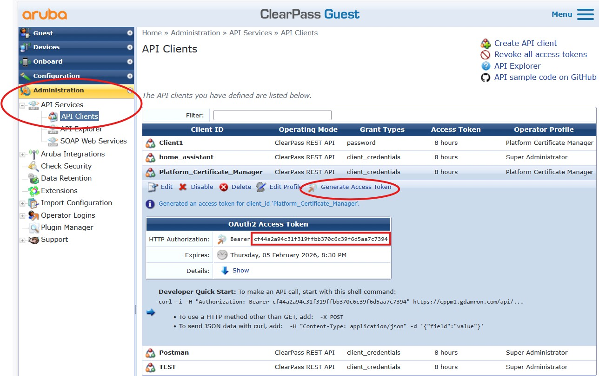
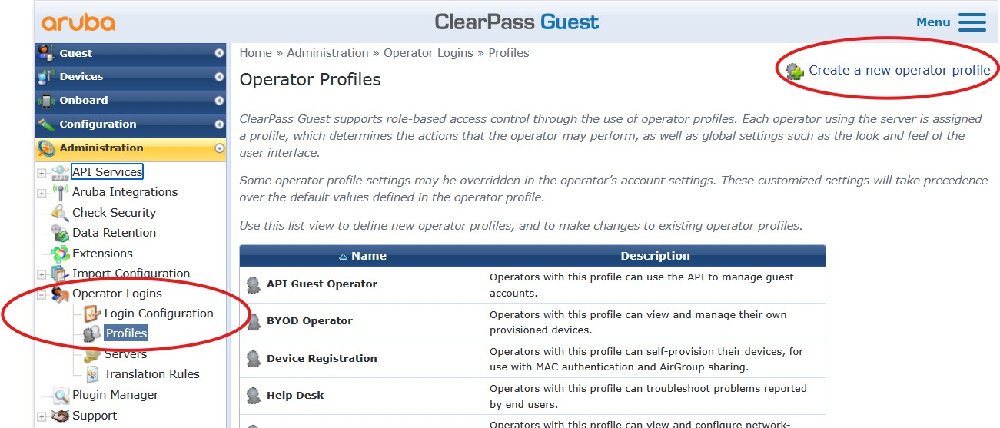
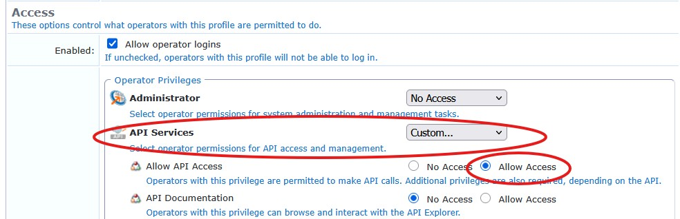
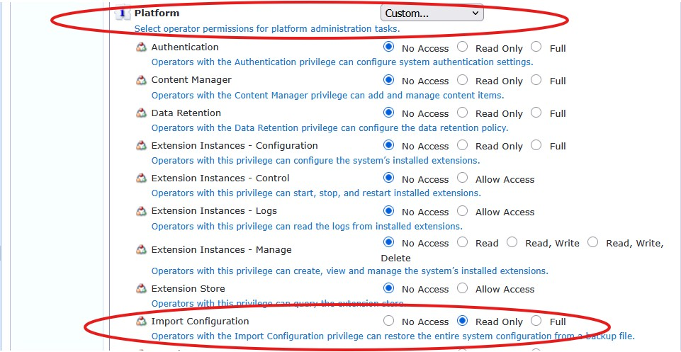
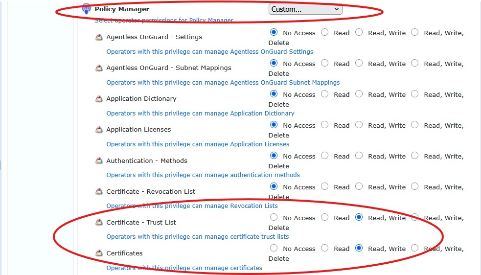
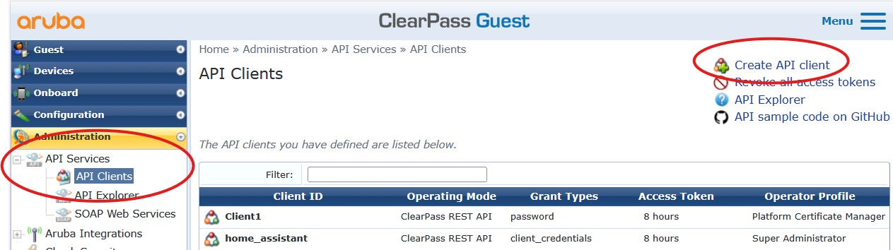
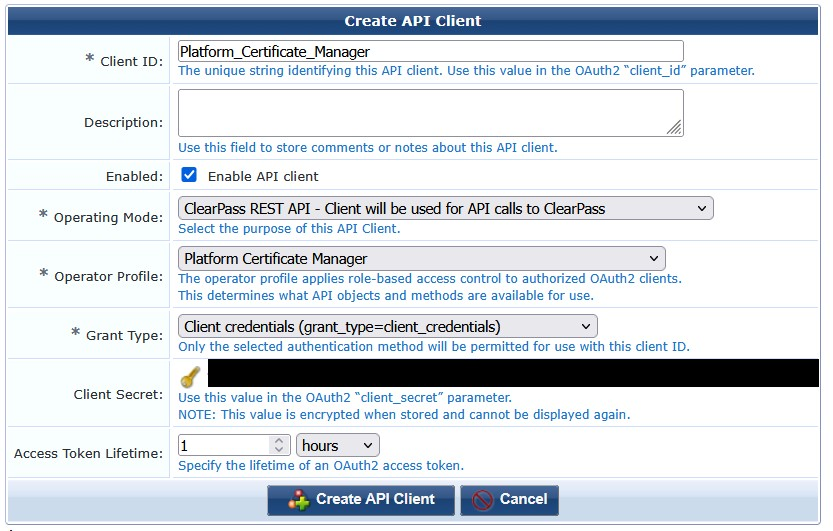

# ClearPass Certificate Manager (Web)

This tool provides a lightweight web UI for viewing and replacing ClearPass certificates across cluster members, plus importing CA/intermediate certificates from a PKCS#12 file.

## Requirements

- Python 3.8+ (recommended)
- Network access from your machine to the ClearPass API and from ClearPass back to this host (for PKCS#12 download)

Python packages:

- `flask`
- `requests`
- `python-dateutil`
- `cryptography`

Install deps:

```bash
python -m pip install flask requests python-dateutil cryptography
```

## Run

```bash
python clearpass/cert_manager/CPPM_CertMgr_Web.py
```

The app binds to `0.0.0.0:5000` and will open a browser to a LAN-accessible URL.

## ClearPass API Client Setup

You need an API token for a ClearPass user or API client with permissions to:

- Read cluster servers
- Read server certificates
- Replace server certificates
- Add CA/intermediate certificates to the trust list

Typical setup flow in ClearPass Policy Manager:

1. Create an API client (or a service account) in the ClearPass admin UI.
2. Grant it the API roles/permissions needed for the certificate endpoints above.
3. Generate an access token (or client credentials token).
4. Paste the token into the UI's **Token** field when connecting.

Notes:

- This UI uses the token you provide and calls ClearPass endpoints such as:
  - `GET /api/cluster/server`
  - `GET /api/server-cert/name/{server_uuid}/{service_name}`
  - `PUT /api/server-cert/name/{server_uuid}/{service_name}`
  - `POST /api/cert-trust-list`
- If you use client ID/secret instead of a static token, ensure the client can obtain tokens from `POST /api/oauth`.

Some users already have an API client; others need to create both the Operator Profile and API client first.

### If you already have an API client with proper permissions

1. Open the existing API client in ClearPass.
2. Generate or copy the access token.
3. Paste the token into the UI's **Token** field.


### If you need to create the Operator Profile and API client

If you're unsure about creating API clients, follow your organization’s security guidelines.

1. Create an Operator Profile for **Platform Certificate Manager**.
  
2. Assign the required permissions.
  
  
  
3. Create a new API client and associate it with that operator profile.
  

  
4. Generate the access token.
  
5. Paste the token into the UI's **Token** field.

## Operational Notes

- ClearPass must be able to reach the PKCS#12 file URL hosted by this tool.
- If ClearPass cannot reach your machine, place the PKCS#12 file on a reachable HTTP server and paste that URL into the UI.
- This is intended for development/ops use; run behind a proper WSGI server for production usage.
